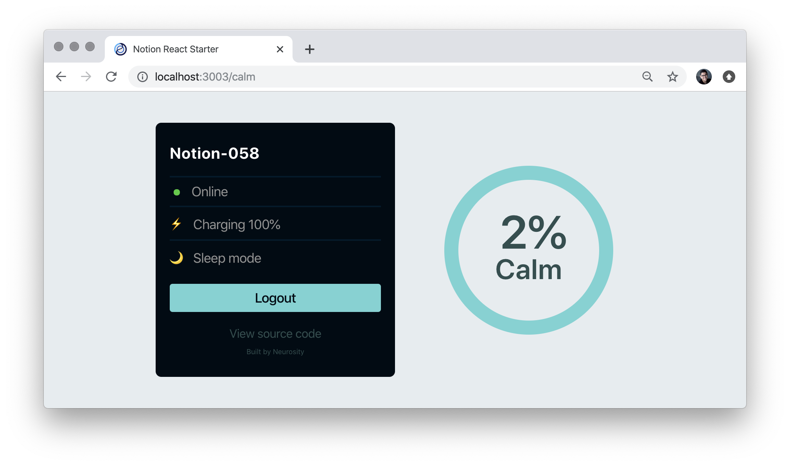

# A Simple Server with Node.js Express

This is a simple skeleton Express server project that works on any of the [balena][balena-link] supported devices.

This project serves up a welcome page on port `:80` of your balena device.

To get this project up and running, you will need to signup for a balena account [here][signup-page] and set up an application and device. You'll find full details in our [Getting Started tutorial][gettingstarted-link].

Once you have downloaded this project, you can `balena push` it using the [balenaCLI][balena-cli]. This command will package up and push the code to the balena builders, where it will be compiled and built and deployed to every device in the application fleet. When it completes, you'll have a node.js web server running on your device and see some logs on your [balenaCloud dashboard][balena-dashboard].

To give your device a public URL, access the device page on the [balenaCloud dashboard][balena-dashboard], and choose the _Public Device URL_ toggle. Alternatively, you can point your browser to your device's IP address.

[balena-link]: https://balena.io/
[signup-page]: https://dashboard.balena-cloud.com/signup
[gettingstarted-link]: http://balena.io/docs/learn/getting-started/
[balena-cli]: https://www.balena.io/docs/reference/cli/
[balena-dashboard]: https://dashboard.balena-cloud.com/

# 🚀 Notion React Starter

### Getting Started

- 1️⃣ `git clone https://github.com/neurosity/notion-react-starter.git`
- 2️⃣ `cd notion-react-starter`
- 3️⃣ `npm install`
- 4️⃣ `npm start`

### The Stack

- ⚛️ Built with React - [Create React App](https://github.com/facebook/create-react-app)
- 🏆 Reach Router - [@reach/router](https://reach.tech/router)
- 🤯 NotionJS API - [@neurosity/notion](https://github.com/neurosity/notion-js)
- 🔑 NotionJS Authentication
- 👍 React Use - [react-use](https://github.com/streamich/react-use)

MIT License
